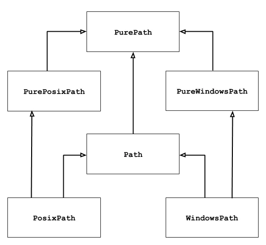

# 3. Pathlib使用

pathlib 是Python内置库，Python 文档给它的定义是 Object-oriented filesystem paths（面向对象的文件系统路径）。pathlib 提供表示文件系统路径的类，其语义适用于不同的操作系统。路径类在纯路径之间划分，纯路径提供纯粹的计算操作而没有I / O，以及具体路径，它继承纯路径但也提供I / O操作。

## 获取当前文件路径

```python
import pathlib
value1 = pathlib.Path.cwd()
print(value1)
```


### 实现原理

它以 os.getcwd() 的形式将路径返回


源码：

```python
@classmethod
def cwd(cls):
	"""Return a new path pointing to the current working directory
        (as returned by os.getcwd()).
	"""
	return cls(os.getcwd())
```

它是对 os 模块中一些对象进行了封装

## 其他的封装

pathlib 封装了很多的 os path ，文档中有写明，如：

> \# 关系说明
>
> os.path.expanduser() --> pathlib.Path.home()
>
> os.path.expanduser() --> pathlib.Path.expanduser()
>
> os.stat() --> path.Path.stat()
>
> os.chmod() --> pathlib.Path.chmod()

## Pathlib 便捷性

### 获取上上层目录

os 模块的写法

```python
import os
print(os.path.dirname(os.path.dirname(os.getcwd())))
```


pathlib的写法

```python
import pathlib
print(pathlib.Path.cwd().parent.parent)
```


### 路径拼接

os 模块的写法

```python
import os
print(os.path.join(os.path.dirname(os.path.dirname(os.getcwd())),"path1","path2","path3"))
```


pathlib的写法

```python
import pathlib
parts=["path1","path2","path3"]
print(pathlib.Path.cwd().parent.parent.joinpath(*parts))

```

## PurePath


> PurePath 是一个纯路径对象，纯路径对象提供了实际上不访问文件系统的路径处理操作。有三种方法可以访问这些类，我们也称之为flavor。


### PurePath.match

判断，当前文件路径是否有符合 '*.py' 规则的文件


```python
import pathlib
print(pathlib.PurePath(__file__).match("*.py"))
```

pathlib.PurePath 后面能够跟着 match，那说明它应该是个对象，而不是一个路径字符串。

```python
import pathlib
import os
os_path = os.path.dirname(__file__)
pure_path = pathlib.PurePath(__file__)
print(os_path,type(os_path))
print(pure_path,type(pure_path))
print(pathlib.PurePath(__file__).math("*.py"))
```

打印通过 os.path 获取当前路径的结果，得出一个路径字符串；而通过 pathlib.Pure 则获得的是一个**PurePosixPath** 对象，并且得到的路径包括了当前文件 coder.py。

 PurePosixPath 究竟是什么？

​	pathlib可以操作两种文件系统路径，一种是Windows文件系统，一种非Windows系统，对应的对象是pathlib.PurePosixPath和PureWindowsPath，这些类并非是指定在某些操作系统上运行才能够使用，无论你运行的是哪个系统，都可以实例化所有这些类，因为它们不提供任何进行系统调用的操作。

文档在最开始给出了这么一段描述:


> Pure paths are useful in some special cases; for example:
> If you want to manipulate Windows paths on a Unix machine (or vice versa). You cannot instantiate a WindowsPath when running on Unix, but you can instantiate PureWindowsPath.
> You want to make sure that your code only manipulates paths without actually accessing the OS. In this case, instantiating one of the pure classes may be useful since those simply don’t have any OS-accessing operations.
>
> 
>
> 
>
> 翻译：纯路径在某些特殊情况下很有用; 例如：
> 如果要在Unix计算机上操作Windows路径（反之亦然）。WindowsPath在Unix上运行时无法实例化，但可以实例化PureWindowsPath。
> 您希望确保您的代码仅操作路径而不实际访问操作系统。在这种情况下，实例化其中一个纯类可能很有用，因为那些只是没有任何操作系统访问操作。




##  对应关系

pathlib不仅封装了 os.path 相关常用方法，还集成了 os 的其他模块，比如创建文件夹 Path.mkdir。

对应关系表

| os.path.abspath() | Path.resolve() |
| ----------------- | -------------- |
|                   |                |
|                   |                |
|                   |                |
|                   |                |
|                   |                |
|                   |                |
|                   |                |
|                   |                |
|                   |                |
|                   |                |
|                   |                |
|                   |                |
|                   |                |
|                   |                |

